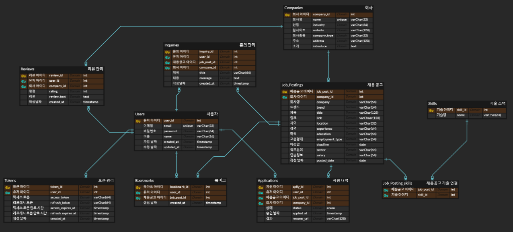

# 📚 Flask Job Portal Backend (WSDemployment)

## ✨ 프로젝트 소개
Flask 기반으로 구현된 구인구직 백엔드 서버입니다. 이 프로젝트는 Flask-Smorest를 사용하여 Swagger 문서를 자동 생성하며, 다양한 API 엔드포인트를 제공합니다.

---

## 📄 ERD 및 주요 기능

- **회원 인증 및 관리** (Auth)
- **구인/구직 정보 크롤링** (Crawl)
- **채용 공고 관리** (Jobs)
- **지원 내역 관리** (Applications)
- **북마크 관리** (Bookmarks)
- **문의사항 처리** (Inquiry)
- **리뷰 관리** (Reviews)

---

## 🛠️ 설치 및 실행 방법

### 1. 요구사항
- Python 3.10+
- Flask
- Flask-Smorest
- Gunicorn
- Supervisor (서버 환경용)

### 2. .env 설정 (예시)
```.env
# dev / prod 설정
ENV = dev

# DB 정보
DB_USER = user
DB_PASSWORD = your_db_password
DB_HOST = localhost
DB_PORT = 3000
DB_NAME = my_db

REDIS_HOST = localhost                # Redis 호스트
REDIS_PORT = 8080                     # Redis 포트
REDIS_DB = 0                          # 사용할 Redis 데이터베이스 번호
REDIS_PASSWORD = your_redis_password

SECRET_KEY = your_secret_key(jwt)

# SERVER 설정
SERVER_PATH = http://localhost:80
```

### 3. 로컬 환경에서 실행하기
1. 가상 환경 생성 및 활성화:
    ```bash
    python -m venv venv
    source venv/bin/activate  # Windows: venv\Scripts\activate
    ```

2. 필요한 패키지 설치:
    ```bash
    pip install -r requirements.txt
    ```

3. 애플리케이션 실행:
    ```bash
    flask run
    ```

4. 로컬에서 Swagger UI 확인:
    - `http://127.0.0.1:5000/`

### 4. 서버 환경에서 실행하기

1. Gunicorn 설치:
    ```bash
    pip install gunicorn
    ```

2. Gunicorn을 통해 애플리케이션 실행 (예시):
    ```bash
    gunicorn -w 3 -b 0.0.0.0:80 app:app
    ```

3. Supervisor 설정 (예시):
    `/etc/supervisor/conf.d/job_portal.conf` (flask-app)
    ```
    [program:job_portal]
    command=/path/to/venv/bin/gunicorn -workers=3 -b 0.0.0.0:80 wsgi:app
    directory=/path/to/project
    environment=FLASK_APP=app.py
    autostart=true
    autorestart=true
    stderr_logfile=/var/log/job_portal.err.log
    stdout_logfile=/var/log/job_portal.out.log
    ```

4. Supervisor 서비스 적용 및 시작:
    ```bash
    sudo supervisorctl reread
    sudo supervisorctl update
    sudo supervisorctl start job_portal

    sudo supervisorctl status job_portal
    sudo supervisorctl restart job_portal
    ```

---

## 🔍 API 엔드포인트

### 1. **Crawl (크롤링 관련 API)**
-  `/crawl/job_posts` - 키워드별 채용 정보 크롤링 및 db 저장
-  `/crawl/company_info` - 회사 정보 크롤링 및 db 저장
-  `/crawl/update/skills` - 기술명 추가

### 2. **Auth (인증 관련 API)**
-  `/auth/register` - 회원가입
-  `/auth/login` - 로그인
-  `/auth/refresh` - 유저 엑세스토큰 재발급
-  `/auth/user` - 유저 정보 조회
-  `/auth/user` - 유저 삭제
-  `/auth/profile` - 유저 정보 수정

### 3. **Jobs (채용 공고 관련 API)**
-  `/job` - 채용 공고 목록 조회 (검색, 필터링, 정렬 포함)
-  `/job` - 새로운 채용 공고 등록
-  `/job` - 채용 공고 수정
-  `/job` - 채용 공고 삭제
-  `/job/search` - 채용 공고 검색
-  `/job/filter` - 채용 공고 필터링
-  `/job/sort` - 채용 공고 정렬
-  `/job/{id}` - 단일 채용 공고 상세 조회

### 4. **Applications (지원 내역 관리 API)**
-  `/application` - 지원 내역 조회
-  `/application` - 지원하기
-  `/application/{apply_id}` - 지원 취소

### 5. **Bookmarks (북마크 관련 API)**
-  `/bookmarks` - 북마크 추가/삭제
-  `/bookmarks` - 북마크 목록 조회

### 6. **Inquiry (문의 관련 API)**
-  `/inquiry` - 사용자 문의 목록 조회
-  `/inquiry` - 사용자 문의 생성
-  `/inquiry/{id}` - 사용자 문의 삭제

### 7. **Reviews (리뷰 관련 API)**
-  `/reviews` - 회사 리뷰 목록 조회
-  `/reviews` - 회사 리뷰 작성
-  `/reviews/{id}` - 리뷰 삭제

---

## 🔧 크롤링 코드 실행 방법

### 1. 크롤링 스크립트 실행
1. 크롤링 스크립트 경로로 이동:
    ```bash
    cd employment_app/services/
    ```

2. 스크립트 실행:
    ```bash
    python crawl_job_post.py
    python crawl_company.py
    ```

### 2. 스케줄링 (옵션)
크론탭을 이용하여 주기적으로 크롤링 작업을 실행할 수 있습니다.

1. 크론탭 열기:
    ```bash
    crontab -e
    ```

2. 작업 추가 (매일 자정 실행 예시):
    ```
    0 0 * * * /path/to/venv/bin/python /path/to/crawling/crawl.py
    ```

---

## 📈 기여하기
1. 이슈를 통해 버그 및 개선점을 제안해주세요.
2. Pull Request를 통해 코드 기여가 가능합니다.

---

## 🔒 라이선스
MIT License를 따릅니다.

